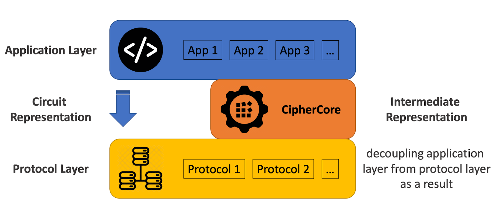

# CipherCore

If you have any questions, or, more generally, would like to discuss CipherCore, please [join the Slack community](https://join.slack.com/t/slack-r5s9809/shared_invite/zt-1901t4ec3-W4pk~nsTl2dY8Is5HFWT4w).

See a vastly extended version of this document [here](https://github.com/ciphermodelabs/ciphercore/blob/main/reference/main.md), which includes a tutorial, several examples and a comprehensive guide.

# Overview

## What is CipherCore?

CipherCore is a general purpose library for processing encrypted data. It’s a state-of-the-art platform for building customized applications that can run directly over encrypted data without decrypting it first. CipherCore can be used to run tasks on multiple distributed datasets owned by multiple organizations within the same enterprise or even different enterprises without disclosing the data to other parties. The library is based on a technology called secure computation.

## What is Secure Computation?

Secure Multi-Party Computation (SMPC) is a cutting-edge subfield of cryptography that provides various types of protocols allowing the execution of certain programs over encrypted data ([read more](https://en.wikipedia.org/wiki/Secure_multi-party_computation)). SMPC protocols take as input a restricted form of computation called [circuit representation](https://en.wikipedia.org/wiki/Boolean_circuit). Translating high-level programs into circuit representation is a complicated, error-prone and time-consuming process. CipherCore compiler drastically simplifies the process by automatically translating and compiling high-level programs directly into the SMPC protocols, thus, allowing any software developer to use secure computation without requiring any knowledge of cryptography.

## CipherCore and Intermediate Representation

CipherCore’s ease of use is due to introducing a new intermediate representation layer of _computation graphs_ between the application layer and the protocol layer. Applications are mapped to a computation graph first and then to an SMPC protocol. This architecture allows for rapid integration of various SMPC protocols as new cryptographic backends. If you are familiar with ML frameworks such as [PyTorch](https://pytorch.org/), [TensorFlow](https://www.tensorflow.org/) or [JAX](https://github.com/google/jax) (or [MLIR](https://mlir.llvm.org/) on a lower level), then you likely know what computation graphs are.

## Bird's eye view of SMPC

At a high level, Secure Multi-Party Computation protocols (SMPC) allow, given a program
with several inputs belonging to several parties, execute it in a way such that:

* The output gets revealed only to a desired set of the parties;
* No party learns anything about inputs belonging to other parties other than what can be inferred from the revealed outputs.

The literature on SMPC is vast and we refer the reader to a [comprehensive overview](https://github.com/rdragos/awesome-mpc) of the existing protocols. Typically, there is a three-way trade-off between:
* Efficiency
* Number of parties
* Threat model

CipherCore is designed in a way that allows most existing SMPC protocols to be readily plugged as a backend. Currently, we support [the ABY3 SMPC protocol](https://eprint.iacr.org/2018/403.pdf), which works for three parties and is one of the most efficient available protocols.

## High-level structure of CipherCore

There are four natural stages when working with CipherCore:

  1. Formulate a computation one wishes to run securely as a computation graph using graph building API;
  2. **Compile** the graph into a new, typically larger, computation graph that corresponds to an SMPC protocol that performs the same computation but, at the same time, preserves the privacy of inputs and outputs. This step can be done using the CipherCore **compiler** that is part of the repository. Currently, we only support the ABY3 SMPC protocol for three non-colluding parties, but this will likely change in the future.
  3. Check that the resulting secure protocol works correctly. This can be done by running it on sample inputs using a **local evaluator**. This repository contains a reference implementation of an evaluator, which is simple, but not efficient. We also provide access to a Docker image that contains a binary of a **fast evaluator**, which is typically several orders of magnitude more efficient. The performance of the fast evaluator is a strong predictor (modulo network interactions) of actual end-to-end secure protocol execution done by three distributed parties;
  4. Execute the secure protocol end-to-end by three actual distributed parties that interact over the network. This can be done using the CipherCore **runtime**. We provide the trial access to the runtime on request. (see [here](reference/main.md#system-requirements-installation-and-licensing) for details).