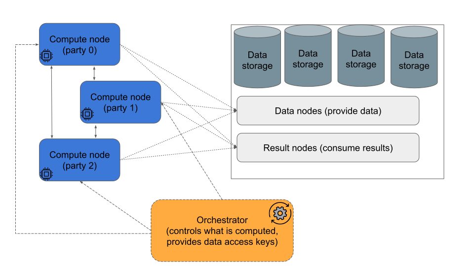

# Runtime

For executing a compiled computation graph, one needs *runtime* that allows parties holding the inputs to perform the actual computation. Due to the nature of SMPC, one needs to run multiple instances of the runtime, which interactively communicate with each other over the network during the execution. The number of instances depends on the SMPC protocol which was used during the compilation stage; currently we support the [ABY3 protocol](https://eprint.iacr.org/2018/403.pdf), which requires three non-colluding parties.

**_NOTE_:** We don't provide the source code of the runtime in the open-source repository. If you want to execute graphs in runtime to measure real-life performance, we provide the binary/docker on request.

The runtime consists of three different entities: *compute nodes* (the runtime itself, which performs the computation), *data nodes* (services which provide the encrypted or plaintext data to the runtime, and consume the results of computation), and *orchestrator node* (controls the high-level structure of the execution: which computation graphs should be executed in which order and on which data).



## Pre-packaged runtime example
We provide a Docker container with a pre-packaged runtime which can be used to do the following: execute a given computation graph once on a given input. This can be useful for trying it out or benchmarking; however, real-life applications often require more complex logic.

TL;DR: there is a single [bash script](https://github.com/ciphermodelabs/ciphercore/blob/main/runtime/example/scripts/do_all.sh) which can run everything end-to-end.
```bash
sh runtime/example/scripts/do_all.sh /tmp/ciphercore
```
But it's possible to perform the steps manually as outlined below. 

For the networking we use 9 ports. For each party it is: ``provide data'' port (42{#party}1), ``get result'' port (42{#party}2), ``computation'' port (42{#party}3).
Feel free to change the scripts in order to use any other ports. (Please note that compute nodes should get the correct ports corresponding for the data and result.)
<details>
  <summary>All ports which are used</summary>
  ```
  4201, 4202, 4203, 4211, 4212, 4213, 4221, 4222, 4223
  ```
</details>

It is assumed that all scripts are running from the root of this repository (ciphercore/).
0. Set up your WORK_DIR:
```bash
export WORK_DIR="/tmp/ciphercore" # Or any other dir
mkdir -p "$WORK_DIR"
mkdir -p "$WORK_DIR"/data
```
1. Pull docker from our private repo ([contact us](https://www.ciphermode.tech/contact-us) to get the token).
```bash
docker login -u runtimecm
docker pull ciphermodelabs/runtime_example:latest
```
2. Generate [certificates](#certificates).
```bash
docker run --rm -u $(id -u):$(id -g) -v "$WORK_DIR":/mnt/external ciphermodelabs/runtime_example:latest /usr/local/ciphercore/run.sh generate_certs certificates/ localhost
```
`localhost` — this is the TLS domain, in real-world deployments, the runtime wouldn't work if domains don't match, but for the purposes of the example, we always override it to localhost.
3. Generate computation graph and data.
Computation could be performed via any graphs produced by the CipherCore compiler (see more about [compiling graphs](https://github.com/ciphermodelabs/ciphercore/blob/main/reference/main.md#working-with-the-graph-using-cli-tools)).
We provide two examples:
* the median of the sequence on the secret-shared input  (each party doesn't have access to the data);
```bash
cp -rf runtime/example/data/median/* "$WORK_DIR"/data/
```
* two millionaires problem with revealed input. 
```bash
cp -rf runtime/example/data/two_millionaires/* "$WORK_DIR"/data/
```
Note that there are two conceptually different cases: secret-shared inputs, and inputs provided by one of the parties. However, in both cases we ask all parties to provide the input — if they don't have it, they should provide any value of the correct type (e.g. zeros or a random value).
4. Start data nodes using the following script.
```bash
sh runtime/example/scripts/run_data_nodes.sh
```
5. Start compute nodes using the following script.
```bash
sh runtime/example/scripts/run_compute_nodes.sh
```
6. Run secure computation.
```bash
sh runtime/example/scripts/run_orchestrator.sh
```
After the end of the computation, the result for each party will be printed. Parties, which are not supposed to see the result, see random ``garbage''.

Now you can also try to use different data/graphs without restarting everything. Just update the corresponding files in folder `$WORK_DIR/data` and call `run_orchestrator.sh` once more
7. Once done, don't forget to stop all processes to release ports.
```bash
sh runtime/example/scripts/tear_down.sh
```

## Implementation of application-specific data and orchestrator nodes

For more complex scenarios, one has to do some additional implementation work. We provide a universal binary for compute nodes, while the implementation of the data nodes and orchestrator(s) has to be application-specific. In most cases, the implementation is fairly straightforward. The interaction of data & orchestrator nodes with compute nodes is done via the following [gRPC](https://en.wikipedia.org/wiki/GRPC) interfaces (gRPC is available in many languages, not just Rust).

Specifications for the gRPC protocols can be found in the following files:

* Data nodes (providing inputs and consuming outputs): `runtime/proto/data.proto` and `runtime/proto/results.proto`
* Orchestrator: `runtime/proto/party.proto`.

The overall process is structured as follows. Each computation is represented as a *session*, which has an associated computation graph, and party-specific data keys. To perform the computation:

* Orchestrator first has to call the `RegisterGraph` RPC method of a compute node, to upload the computation graph to each compute node (once per graph, the same graph can be re-used in different sessions);
* Then, it has to call `CreateSession`, providing the id of the registered graph, as well as keys for data nodes (party-specific), and addresses of other compute nodes;
* Compute nodes retrieve their inputs from the data nodes, connect to each other, interactively run the computation protocol, and send the results back to data nodes;
* Once the computation is finished, the session should be removed with the `FinishSession` call to free up the memory. Multiple sessions can run in parallel.

Data nodes and orchestrator can be separate, or combined in any way. However, compute nodes must be separate, moreover,

**NO TWO COMPUTE NODES CAN BE CONTROLLED BY THE SAME ENTITY,**

otherwise this entity can decrypt the data.

## Certificates
An important part of runtime setup are TLS certificates. They specify which pairs of nodes can talk to each other, and make the communication secure via TLS encryption.

> **_NOTE:_**  The communication between compute nodes is already encrypted - most of the values they send to each other are indistinguishable from random noise by construction. However, this is not secure enough - if a certain party (e.g. router) gets access to all communication, they can reconstruct plaintext data. So an additional layer of encryption is required. 

Currently, the certificates are structured as follows. We generate our own root (CA) certificate. Then, we use it to issue certificates for all nodes. All nodes have the public key for CA, so they can validate the certificates of the nodes they're connecting to.

The certificates can be generated with the following script: **TODO**

In real-life use-cases, sometimes an additional level of certificate hierarchy might be required. Imagine e.g. a cross-organization use-case: we might want to issue per-organization certificates, which organizations then use to issue certificates for their nodes. Note that there is an assumption that the owner of CA does not collude with any of the parties.

## Example of a custom runtime

For this example, we implement all three data nodes and orchestrator in a single Python script (not suitable for real-life deployments). We'll use the graph and inputs from the Rust example: the graph describes the computation of a median element in an array, and the input is this array secret-shared between the parties.

### Python-based data nodes and orchestrator

For the Python wrapper, one needs to generate the gRPC Python files from the proto files as follows:

```bash
python -m grpc_tools.protoc \
    -Iruntime/proto \
    --python_out=runtime/example/python \
    --grpc_python_out=runtime/example/python \
    runtime/proto/*.proto
```

This generates Python bindings for the proto files (a bunch of barely-readable Python files with `pb2` in their names).

You can find the ready-to-use example at `runtime/example/python/combined_example.py`. Below we go over it step-by-step and explain what is happening. 

First, let's implement the data nodes in Python. For each data node, we'll need to export two RPC services: for providing input data, and for consuming results. Both are straightforward:

```python
class KVDataServer(data_pb2_grpc.DataManagerServiceServicer):
    def __init__(self, kv_dict):
        super().__init__()
        self.kv_dict = kv_dict

    def GetValue(self, request, context):
        k = request.key
        vals = self.kv_dict.get(k)
        resp = data_pb2.GetValueResponse()
        if vals is None:
            resp.status = 1
            resp.error = 'Not found'
        else:
            resp.status = 0
            resp.typed_value.extend(vals)
        return resp


class TrivialResultServer(results_pb2_grpc.ResultProviderServiceServicer):
    def ProvideResult(self, request, context):
        print('Got result:', request)
        print('Decoded:', np.frombuffer(request.typed_value.value.bytes.data, dtype=np.int32))
        resp = results_pb2.ProvideResultResponse()
        resp.status = 0
        return resp
```

What is happening here? The `KVDataServer` just serves responses from the provided dict, and `TrivialResultServer` prints whatever it gets to stdout. One remaining piece is to load the data from the `KVDataServer` to serve. Here is how we do it:

```python
def load_typed_values(path):
    with open(path, 'r') as f:
        json_data = f.read()
    json_bytes_arr = json.loads(json_data)
    vals = []
    for json_bytes in json_bytes_arr:
        val = TypedValue()
        val.ParseFromString(bytes(json_bytes))
        vals.append(val) 
    res = {'test'.encode(): vals}
    return res
```

This is straightforward: we read the proto (typed) values from the provided file, and put them ito the dictionary.

Now we have all the pieces to start data nodes. For each data node, we do the following:

```python
def read_file(path):
    return open(path, 'rb').read()


server_credentials = grpc.ssl_server_credentials(((
    read_file(os.path.join(getattr(args, 'data_dir%d' % i), 'data_key.pem')),
    read_file(os.path.join(getattr(args, 'data_dir%d' % i), 'data_cert.pem')),
),))

server = grpc.server(futures.ThreadPoolExecutor(max_workers=10))
values = load_values(os.path.join(getattr(args, 'data_dir%d' % i), 'input_share_proto.txt'))
data_pb2_grpc.add_DataManagerServiceServicer_to_server(KVDataServer(values), server)
server.add_secure_port('[::]:%d' % getattr(args, 'data_port%d' % i),
                        server_credentials)
server.start()
servers.append(server)

server = grpc.server(futures.ThreadPoolExecutor(max_workers=10))
results_pb2_grpc.add_ResultProviderServiceServicer_to_server(TrivialResultServer(), server)
server.add_secure_port('[::]:%d' % getattr(args, 'result_port%d' % i),
                        server_credentials)
server.start()
servers.append(server)
```

The only nontrivial part here is the `server_credentials` variable. We need to use the private key of the server to start it.

The only remaining part is orchestrator. It connects to compute nodes with the following helper:

```python
def create_client_stub(addr, ca_cert):
    NUM_RETIRES  = 100
    delay = 1.0
    for attempt in range(NUM_RETIRES):
        try:
            channel_credential = grpc.ssl_channel_credentials(ca_cert)
            channel = grpc.secure_channel(addr, channel_credential,
                                          # Certificates were generated for localhost, so we make sure
                                          # that we check them against 'localhost' domain.
                                          # This should not be used in production.
                                          options=[('grpc.ssl_target_name_override', 'localhost')])
            stub = party_pb2_grpc.PartyServiceStub(channel)
            _ = stub.ListSessions(party_pb2.SessionListRequest())
            return stub
        except:
            if attempt == NUM_RETIRES - 1:
                raise
            print("Could not connect, retrying")
            time.sleep(delay)
            delay *= 1.1
            delay = min(delay, 30.0)
```

Two things to note here:
*  We're doing retries, to avoid race conditions in what is started first;
*  We use the `grpc.ssl_target_name_override` parameter, to circumvent TLS domain name check. This is hacky and exposes us to MitM-style attacks by the root certificate owner. This is good for testing, but should not be used in production.

Then, we connect to nodes using this helper, register the graph and start the computation session:

```python
cert = read_file(args.ca_pem)
print('Connecting to compute nodes')
stubs = [
    create_client_stub('localhost:%d' % getattr(args, 'compute_port%d' % i),
                        cert)
    for i in range(3)
]
print('Connected to compute nodes')
graph_id = str(uuid.uuid4())
context = read_file(args.context_path)
for stub in stubs:
    resp = stub.RegisterGraph(party_pb2.RegisterGraphRequest(graph_json=context, graph_id=graph_id))
    assert resp.result == 0
print('Registered graphs')
sess_id = str(uuid.uuid4())
for i, stub in enumerate(stubs):
    data_key = data_pb2.DataRequest(key=b'test')
    req = party_pb2.CreateSessionRequest(
        session_id=sess_id, graph_id=graph_id, party_id=i,
        data_settings=data_key.SerializeToString())
    for j in range(3):
        addr = party_pb2.Address(address='localhost', port=getattr(args, 'compute_port%d' % j))
        req.party_address.append(addr)
    resp = stub.CreateSession(req)
    assert resp.result == 0
print('Created sessions')
```

Finally, we need to wait for the session to finish, which we do by repeatedly querying the list of sessions, and checking if they're still running:

```python
while True:
    done = True
    for stub in stubs:
        resp = stub.ListSessions(party_pb2.SessionListRequest())
        # Note: statuses 0 and 1 correspond to "finished" and "failed" respectively.
        if any([s.status in [0, 1] for s in resp.session]):
            done = False
            break
    if done:
        break
    time.sleep(0.1)
print('Sessions done')
for stub in stubs:
    _ = stub.FinishSession(party_pb2.FinishSessionRequest(session_id=sess_id))
```

Note that once everything is done, we need to call `FinishSession` to free up the memory. It doesn't matter for this example, but might matter for more complicated flows (e.g. ML model training).

### Running everything

Now that we have the implementation, it is time to start the runtime. We assume that `$DATA_DIR` contains the data layout for the prepackaged runtime example, and `scripts/run_compute_node.sh` invokes the runtime compute node. Let's start the compute nodes:

```bash
sh scripts/run_compute_node.sh 4203 4201 4202 \
    ${DATA_DIR}/ca.pem ${DATA_DIR}/party0/cert.pem ${DATA_DIR}/party0/key.pem &
sh scripts/run_compute_node.sh 4213 4211 4212 \
    ${DATA_DIR}/ca.pem ${DATA_DIR}/party1/cert.pem ${DATA_DIR}/party1/key.pem &
sh scripts/run_compute_node.sh 4223 4221 4222 \
    ${DATA_DIR}/ca.pem ${DATA_DIR}/party2/cert.pem ${DATA_DIR}/party2/key.pem &
```

Now compute nodes are running, but they're just idling, since no one told them what to do. Let's start our Python code which creates data nodes and then runs orchestrator for the example graph:

```bash
python runtime/example/python/combined_example.py \
    --data_dir0=${DATA_DIR}/party0 \
    --data_dir1=${DATA_DIR}/party1 \
    --data_dir2=${DATA_DIR}/party2 \
    --ca_pem=${DATA_DIR}/ca.pem \
    --context_path=${DATA_DIR}/graph.json
``` 

After some time, it creates all the servers and establishes the connection to the compute nodes and runs the computation session. The output should look similar to the following:

```
Connecting to compute nodes
Connected to compute nodes
Registered graphs
Created sessions
Got result: key: "df4fbbb6-c7c5-4909-ae28-f09d58653a7a"
value {
  bytes {
    data: "\367\276\372\204"
  }
}

Decoded: [-2063941897]
Got result: key: "df4fbbb6-c7c5-4909-ae28-f09d58653a7a"
value {
  bytes {
    data: "\377\001\000\000"
  }
}

Decoded: [511]
Got result: key: "df4fbbb6-c7c5-4909-ae28-f09d58653a7a"
value {
  bytes {
    data: "!\256\317\231"
  }
}

Decoded: [-1714442719]
Sessions done
```

Note that it prints results from all parties, but we reveal it only to one party, so it gets the correct one (511), while the rest get random.
